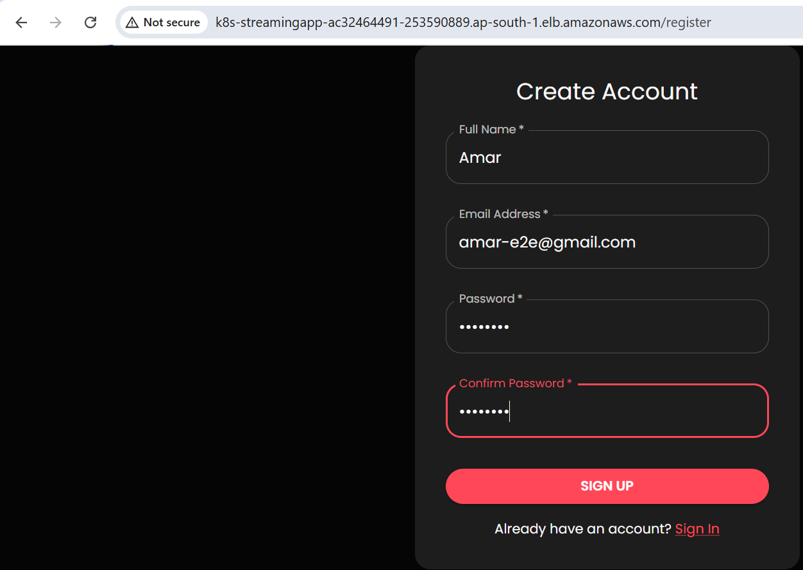
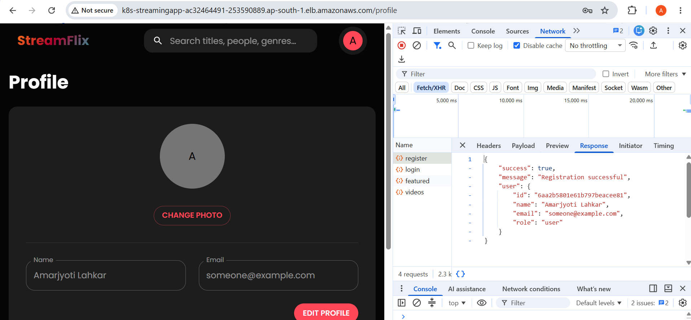
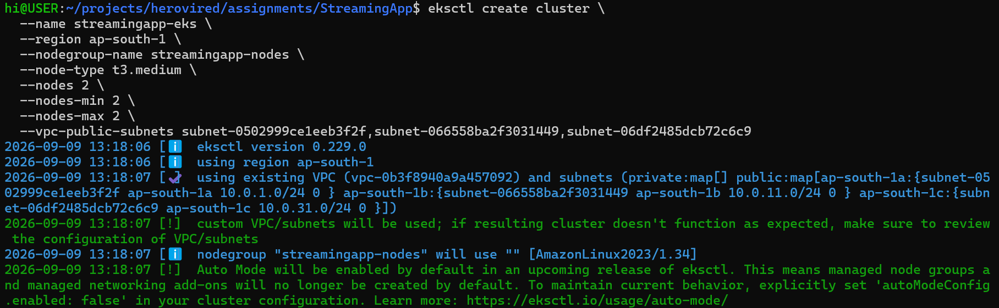
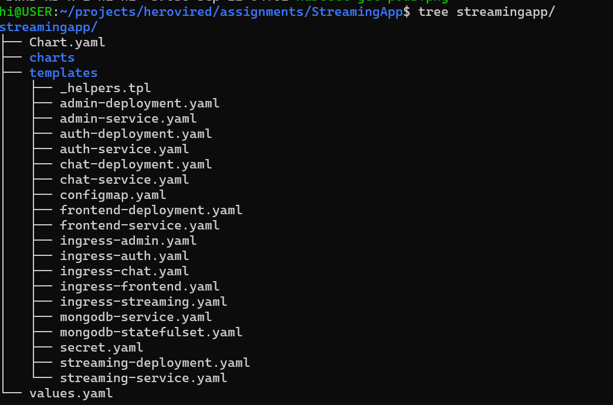
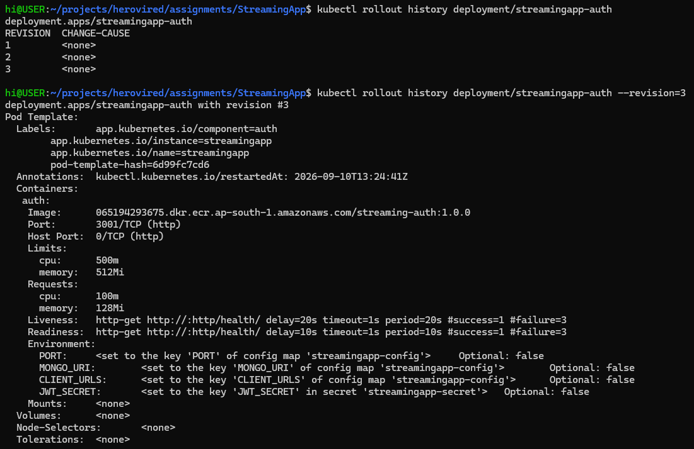
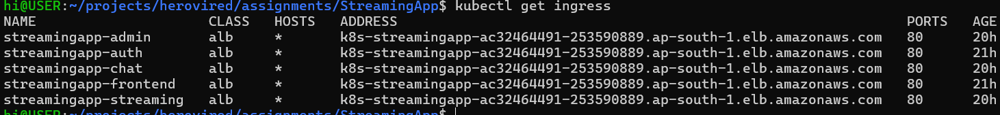
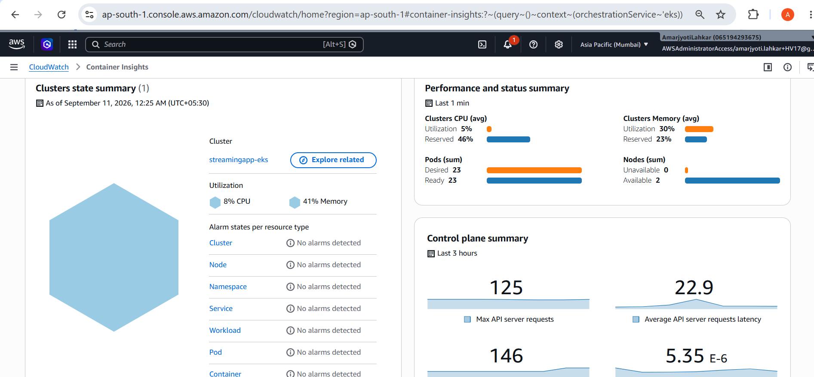
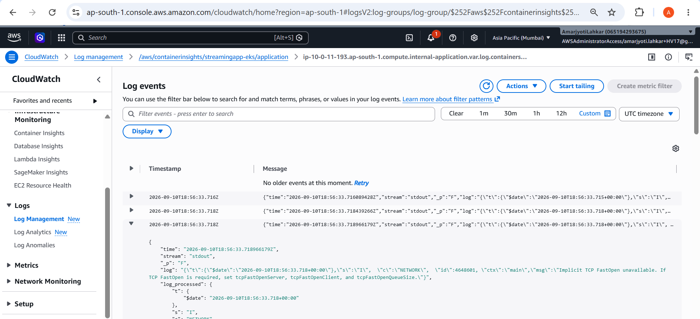

# StreamingApp — Orchestration and Scaling
A MERN-based streaming application containerized with Docker and deployed on Amazon EKS using Helm, Kubernetes Deployments, Services, persistent storage, and AWS Load Balancer Controller.

## Architecture

```text
                         Internet
                            |
                     AWS Application
                      Load Balancer
                            |
              +-------------+-------------+
              | Kubernetes Ingress Group |
              +-------------+-------------+
                 |      |      |      |      |
                /api   /api   /api   /api   /
                auth streaming admin  chat frontend
                 |      |      |      |      |
              Auth   Streaming Admin  Chat  React/Nginx
              :3001    :3002    :3003  :3004    :80
                 \       |       |       | 
                  +------+-------+-------+
                         |
                      MongoDB
                    StatefulSet
                       :27017
                         |
                    EBS PVC (1Gi)
````
## Desired Result via ALB


## Application Components

| Component        |  Port | Kubernetes Resource                 |
| ---------------- | ----: | ----------------------------------- |
| AuthService      |  3001 | Deployment + ClusterIP Service      |
| StreamingService |  3002 | Deployment + ClusterIP Service      |
| AdminService     |  3003 | Deployment + ClusterIP Service      |
| ChatService      |  3004 | Deployment + ClusterIP Service      |
| Frontend         |    80 | Deployment + ClusterIP Service      |
| MongoDB          | 27017 | StatefulSet + PersistentVolumeClaim |

## Technology Stack

* Docker
* Amazon ECR
* Amazon EKS
* Kubernetes
* Helm
* AWS Load Balancer Controller
* Application Load Balancer (ALB)
* Amazon EBS
* MongoDB 6
* React
* Node.js / Express
* Socket.IO

## EKS Cluster Creation


## Kubernetes / Helm

A single Helm chart is used for the complete application:



The chart provides configurable:
```
* Replica counts
* CPU and memory requests/limits
* Container images and tags
* Service ports
* MongoDB persistence
* JWT secret
* Ingress routing
```

```
### Resource Configuration


Backend services:
```text
Requests: 100m CPU / 128Mi memory
Limits:   500m CPU / 512Mi memory
```

Frontend:

```text
Requests: 50m CPU / 64Mi memory
Limits:   200m CPU / 256Mi memory
```

### Scaling
Replica counts are controlled through `values.yaml`.

Scaling was demonstrated by increasing AuthService from:

```text
1 replica → 2 replicas
hi@USER:~/projects/herovired/assignments/StreamingApp$ kubectl scale deployment streamingapp-auth --replicas=2
deployment.apps/streamingapp-auth scaled
hi@USER:~/projects/herovired/assignments/StreamingApp$ kubectl get deployment
NAME                     READY   UP-TO-DATE   AVAILABLE   AGE
streamingapp-admin       1/1     1            1           5h32m
streamingapp-auth        2/2     2            2           6h56m
streamingapp-chat        1/1     1            1           5h20m
streamingapp-frontend    1/1     1            1           4h46m
streamingapp-streaming   1/1     1            1           6h24m
hi@USER:~/projects/herovired/assignments/StreamingApp$ kubectl get pods -l app.kubernetes.io/component=auth
NAME                                 READY   STATUS    RESTARTS   AGE
streamingapp-auth-865548586d-9sfgt   1/1     Running   0          61s
streamingapp-auth-865548586d-r2p8q   1/1     Running   0          5m57s

```

and subsequently restoring it to the Helm-defined state of:

```text
1 replica
hi@USER:~/projects/herovired/assignments/StreamingApp$ helm upgrade streamingapp ./streamingapp
Release "streamingapp" has been upgraded. Happy Helming!
NAME: streamingapp
LAST DEPLOYED: Thu Sep 10 11:57:32 2026
NAMESPACE: default
STATUS: deployed
REVISION: 19
TEST SUITE: None
hi@USER:~/projects/herovired/assignments/StreamingApp$ kubectl get deployment streamingapp-auth
NAME                READY   UP-TO-DATE   AVAILABLE   AGE
streamingapp-auth   1/1     1            1           7h1m

```

### Rolling Updates

Deployments use Kubernetes:

```text
strategy: RollingUpdate
hi@USER:~/projects/herovired/assignments/StreamingApp$ kubectl get deployment streamingapp-auth \
  -o jsonpath='{.spec.strategy.type}{"\n"}'
RollingUpdate

```

Rollout history was verified on the AuthService Deployment.


## Persistent Storage

MongoDB runs as a StatefulSet with persistent storage:

```text
StorageClass: gp2
Capacity:     1Gi
Access Mode:  ReadWriteOnce
Status:       Bound
```

The AWS EBS CSI driver is installed and active in the EKS cluster.
```bash
hi@USER:~/projects/herovired/assignments/StreamingApp$ aws eks list-addons \
  --cluster-name streamingapp-eks \
  --region ap-south-1
{
    "addons": [
        "aws-ebs-csi-driver",
        "coredns",
        "kube-proxy",
        "vpc-cni"
    ]
}
```

## Ingress Routing

The AWS Load Balancer Controller manages a shared internet-facing ALB.


| Path               | Backend          |
| ------------------ | ---------------- |
| `/api/auth/*`      | AuthService      |
| `/api/streaming/*` | StreamingService |
| `/api/admin/*`     | AdminService     |
| `/api/chat/*`      | ChatService      |
| `/socket.io/*`     | ChatService      |
| `/`                | Frontend         |

ALB URL rewriting is used where the external path differs from the application's internal route structure.

## Health Checks

Kubernetes liveness and readiness probes are configured for all application workloads.

| Service          | Health Endpoint |
| ---------------- | --------------- |
| AuthService      | `/health/`      |
| StreamingService | `/api/health/`  |
| AdminService     | `/api/health`   |
| ChatService      | `/api/health`   |
| Frontend         | `/`             |

## Validation

The deployed application was validated through the external ALB.

| Endpoint                          |   Result |
| --------------------------------- | -------: |
| Frontend `/`                      | HTTP 200 |
| Auth `/api/auth/login`            | HTTP 400 |
| Streaming `/api/streaming/videos` | HTTP 200 |
| Admin `/api/admin/health`         | HTTP 200 |
| Chat `/api/chat/history/test`     | HTTP 401 |

The `400` and `401` responses are expected application-level responses and confirm that the requests reached the appropriate backend services.

All application pods and MongoDB were verified as:

```text
READY:     1/1
STATUS:    Running
RESTARTS:  0
```

## Observability and log events




## Known Limitation

ChatService REST routing and the Socket.IO polling handshake were successfully validated.

The actual Socket.IO WebSocket upgrade has not yet been fully validated and remains a follow-up item.

## Deployment

### Prerequisites

* AWS CLI
* kubectl
* Helm
* Docker
* EKS cluster
* Amazon ECR repositories
* AWS Load Balancer Controller

### Deploy

Install or upgrade the application using:

```bash
hi@USER:~/projects/herovired/assignments/StreamingApp$ helm upgrade --install streamingapp ./streamingapp --set-string secret.jwtSecret="$(openssl rand -base64 32)"
Release "streamingapp" has been upgraded. Happy Helming!
NAME: streamingapp
LAST DEPLOYED: Thu Sep 10 04:56:35 2026
NAMESPACE: default
STATUS: deployed
REVISION: 2
TEST SUITE: None

```

For subsequent upgrades, retain the existing Helm release values rather than generating a new JWT secret.

### Verify and smoke test

```bash
hi@USER:~/projects/herovired/assignments/StreamingApp$ kubectl get deployments
NAME                     READY   UP-TO-DATE   AVAILABLE   AGE
streamingapp-admin       1/1     1            1           11h
streamingapp-auth        1/1     1            1           12h
streamingapp-chat        1/1     1            1           11h
streamingapp-frontend    1/1     1            1           10h
streamingapp-streaming   1/1     1            1           12h
hi@USER:~/projects/herovired/assignments/StreamingApp$ kubectl get pods
NAME                                      READY   STATUS    RESTARTS       AGE
streamingapp-admin-794d565c8-5gz9f        1/1     Running   3 (113m ago)   117m
streamingapp-auth-6d99fc7cd6-rnd5p        1/1     Running   3 (114m ago)   117m
streamingapp-chat-69445788df-zglzc        1/1     Running   3 (114m ago)   117m
streamingapp-frontend-5bbc7c7866-rcj7t    1/1     Running   0              117m
streamingapp-mongodb-0                    1/1     Running   0              117m
streamingapp-streaming-746dd65867-724t5   1/1     Running   3 (113m ago)   117m
hi@USER:~/projects/herovired/assignments/StreamingApp$ kubectl get services
NAME                     TYPE        CLUSTER-IP       EXTERNAL-IP   PORT(S)     AGE
kubernetes               ClusterIP   172.20.0.1       <none>        443/TCP     28h
streamingapp-admin       ClusterIP   172.20.32.205    <none>        3003/TCP    11h
streamingapp-auth        ClusterIP   172.20.162.42    <none>        3001/TCP    12h
streamingapp-chat        ClusterIP   172.20.70.220    <none>        3004/TCP    11h
streamingapp-frontend    ClusterIP   172.20.164.155   <none>        80/TCP      10h
streamingapp-mongodb     ClusterIP   172.20.198.95    <none>        27017/TCP   13h
streamingapp-streaming   ClusterIP   172.20.204.91    <none>        3002/TCP    12h
hi@USER:~/projects/herovired/assignments/StreamingApp$ kubectl get ingress
NAME                     CLASS   HOSTS   ADDRESS                                                              PORTS   AGE
streamingapp-admin       alb     *       k8s-streamingapp-ac32464491-253590889.ap-south-1.elb.amazonaws.com   80      9h
streamingapp-auth        alb     *       k8s-streamingapp-ac32464491-253590889.ap-south-1.elb.amazonaws.com   80      9h
streamingapp-chat        alb     *       k8s-streamingapp-ac32464491-253590889.ap-south-1.elb.amazonaws.com   80      8h
streamingapp-frontend    alb     *       k8s-streamingapp-ac32464491-253590889.ap-south-1.elb.amazonaws.com   80      9h
streamingapp-streaming   alb     *       k8s-streamingapp-ac32464491-253590889.ap-south-1.elb.amazonaws.com   80      9h
hi@USER:~/projects/herovired/assignments/StreamingApp$ kubectl get pvc
NAME                                  STATUS   VOLUME                                     CAPACITY   ACCESS MODES   STORAGECLASS   VOLUMEATTRIBUTESCLASS   AGE
mongodb-data-streamingapp-mongodb-0   Bound    pvc-e9765259-1818-4dec-9689-58562dafc993   1Gi        RWO            gp2            <unset>                 13h
```


## Deployment Issues & Fixes

### 1. CORS configuration not reflected in running AuthService pod

After exposing the application through the AWS Load Balancer Controller ALB, the frontend initially received HTTP 500 responses from the AuthService.

The AuthService logs showed:

```text
Error: Not allowed by CORS
```

The Helm ConfigMap was updated to allow both local development and the ALB origin:

```yaml
hi@USER:~/projects/herovired/assignments/StreamingApp$ kubectl get configmap streamingapp-config \
  -o jsonpath='{.data.CLIENT_URLS}{"\n"}'
http://localhost:3000,http://k8s-streamingapp-ac32464491-253590889.ap-south-1.elb.amazonaws.com
```

However, the running AuthService pod still contained the old environment value:

```text
http://localhost:3000
```

This happened because Kubernetes does not automatically restart pods when a ConfigMap value referenced through `env.valueFrom.configMapKeyRef` changes.

The AuthService deployment was therefore restarted:

```bash
hi@USER:~/projects/herovired/assignments/StreamingApp$ kubectl rollout restart deployment/streamingapp-auth
deployment.apps/streamingapp-auth restarted
hi@USER:~/projects/herovired/assignments/StreamingApp$ kubectl rollout status deployment/streamingapp-frontend
Waiting for deployment "streamingapp-frontend" rollout to finish: 1 old replicas are pending termination...
Waiting for deployment "streamingapp-frontend" rollout to finish: 1 old replicas are pending termination...
deployment "streamingapp-frontend" successfully rolled out
```

The updated environment was then verified:

```bash
hi@USER:~/projects/herovired/assignments/StreamingApp$ kubectl exec deployment/streamingapp-auth -- printenv CLIENT_URLS
http://localhost:3000,http://k8s-streamingapp-ac32464491-253590889.ap-south-1.elb.amazonaws.com
```

Result: both localhost and ALB

```text
http://localhost:3000,http://k8s-streamingapp-ac32464491-253590889.ap-south-1.elb.amazonaws.com
```

The browser was subsequently able to communicate with AuthService through the ALB.

### 2. React SPA routes returned Nginx 404

The application root `/` worked correctly, but directly accessing a React route such as:

```text
/login
```

returned:

```text
404 Not Found - nginx/1.27.5
```

The frontend was using the default Nginx configuration:

```nginx
location / {
    root /usr/share/nginx/html;
    index index.html index.htm;
}
```

Nginx therefore attempted to find `/login` as a physical file instead of forwarding the request to the React application.

A custom `frontend/nginx.conf` was added:

```nginx
server {
    listen 80;
    server_name _;

    root /usr/share/nginx/html;
    index index.html;

    location / {
        try_files $uri $uri/ /index.html;
    }
}
```

The Dockerfile was updated to copy this configuration into the Nginx image:

```dockerfile
COPY nginx.conf /etc/nginx/conf.d/default.conf
```

A new frontend image (`1.0.2`) was built, pushed to ECR, and deployed through Helm.

The Nginx configuration was validated inside the image:

```bash
hi@USER:~/projects/herovired/assignments/StreamingApp$ docker run --rm streaming-frontend:1.0.2 \
  nginx -T 2>&1 | grep -A8 -B3 "try_files"
    index index.html;

    location / {
        try_files $uri $uri/ /index.html;
    }
}

nginx: configuration file /etc/nginx/nginx.conf test is successful
```

The ALB route was then verified:

```bash
hi@USER:~/projects/herovired/assignments/StreamingApp$ curl -i "$ALB/login"
HTTP/1.1 200 OK
Date: Thu, 10 Sep 2026 13:44:52 GMT
Content-Type: text/html
Content-Length: 645
Connection: keep-alive
Server: nginx/1.27.5
Last-Modified: Thu, 10 Sep 2026 12:49:06 GMT
ETag: "6aa2a742-285"
Accept-Ranges: bytes

<!doctype html><html lang="en"><head><meta charset="utf-8"/><link rel="icon" href="/favicon.ico"/><meta name="viewport" content="width=device-width,initial-scale=1"/><meta name="theme-color" content="#000000"/><meta name="description" content="Web site created using create-react-app"/><link rel="apple-touch-icon" href="/logo192.png"/><link rel="manifest" href="/manifest.json"/><title>StreamFlix</title><script defer="defer" src="/static/js/main.a24236c4.js"></script><link href="/static/css/main.c78d62fe.css" rel="stylesheet"></head><body><noscript>You need to enable JavaScript to run this app.</noscript><div id="root"></div></body></html>
```

The route returned HTTP 200 and the React `index.html`.
AUTH service logs after the update
```bash
hi@USER:~/projects/herovired/assignments/StreamingApp$ kubectl logs deployment/streamingapp-auth --tail=50

> authservice@1.0.0 start
> node index.js

Connecting to MongoDB at: mongodb://streamingapp-mongodb:27017/streamingapp
(node:18) [MONGODB DRIVER] Warning: useNewUrlParser is a deprecated option: useNewUrlParser has no effect since Node.js Driver version 4.0.0 and will be removed in the next major version
(Use `node --trace-warnings ...` to show where the warning was created)
(node:18) [MONGODB DRIVER] Warning: useUnifiedTopology is a deprecated option: useUnifiedTopology has no effect since Node.js Driver version 4.0.0 and will be removed in the next major version
Authentication Service Started at port 3001
DB connection established
MongoDB Connected Successfully
```

### Browser End-to-End Validation

After both deployment issues were resolved:

* `/register` → **HTTP 201 Created** ✅
* `/login` → **successful authentication** ✅
* JWT returned by AuthService → **validated** ✅
* CORS rejection → **resolved** ✅
* React `/login` route through ALB → **working** ✅

These fixes were implemented at the Kubernetes/Helm/container deployment layer without modifying the application source code.


## Project Objective

This project demonstrates container orchestration and scaling of a multi-service MERN application using:

```text
Docker → ECR → EKS → Kubernetes → Helm
                              ↓
                         ALB Ingress
                              ↓
                       Persistent EBS
```

The implementation demonstrates:

* Containerization
* Kubernetes orchestration
* Helm-based deployment
* Configurable replicas
* Resource requests and limits
* Horizontal scaling
* Rolling updates
* Liveness/readiness probes
* Kubernetes Services
* ConfigMaps and Secrets
* Persistent storage
* ALB-based Ingress routing
* External service validation


